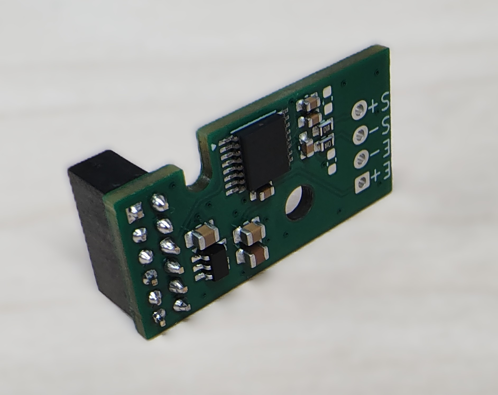
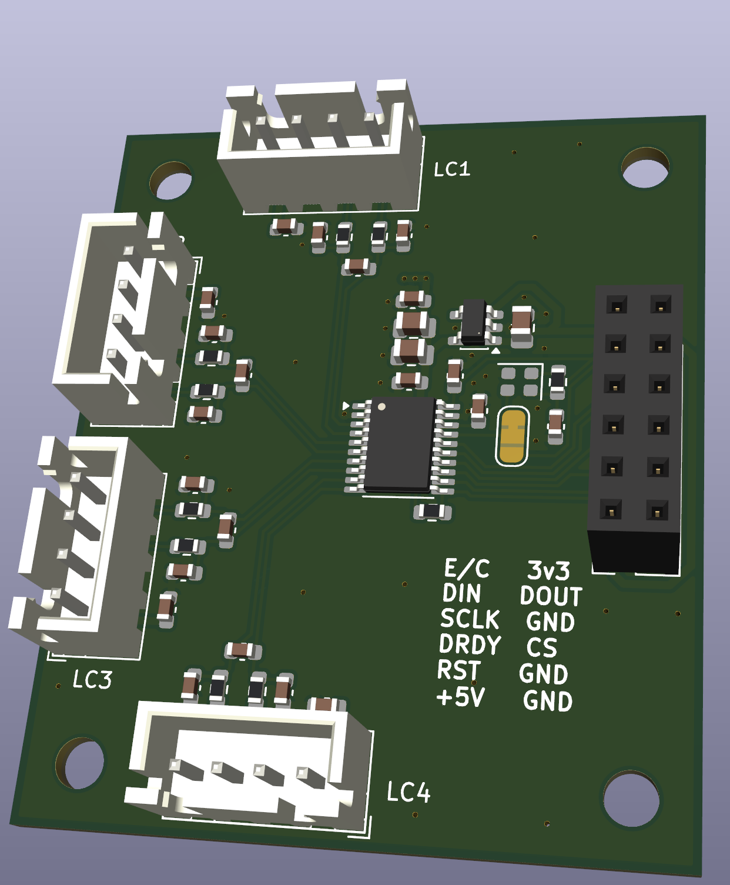

# Plimsoll

Prototype designs for klipper load cell ADC implementations.

### Alpha Test


STM32F072 and HX717 based strain gauge for use as a Klipper load cell.

Initial batch ordered for testing with JLCPCB.  About 5.5 USD cost per board.

Firmware and configuration tested with [current community test branch](https://github.com/garethky/klipper/tree/load-cell-probe-community-testing).

Smallish size, 20x50 mm footprint.  M2.5 mounting holes.  Fab house added the smaller tooling holes...

4 layer PCB all parts on top side.

MCU selected for crystal less USB operation with minimum of 64k flash for firmware.

Separate low noise, high PSRR for analog Vdd supply.

HX717 default data rate 320 Hz.  Adjustable with solder jumpers.

> [!NOTE]
>
> Crystal less main clock is problematic with Klipper and maybe the HX717 code.
>
> Works fine 90% of time, but suffers from occasional timeouts during probes.

### Mini HX717 / Mini ADS1220



Addon for a FYSETC H36 Toolhead board.  Uses the 2x6 2mm expansion pin headers for mounting.

Straight needle 2mm 2x6 female pin header (4.3mm plastic body) fits with 6mm standoff but doesn't clear the _IO.0+1_ with a cable installed. A bent needle 2mm 2x6 header works (6mm plastic body) with 8mm standoff after bending the pins to be straight.

4 layer PCB all parts on top side.

Separate low noise, high PSRR for analog Vdd supply.

HX717 data rate 320 Hz.  

ADS1220 hardware SPI connections.

```
Klipper config for the two mini boards

sensor_type: ads1220
cs_pin: toolhead:PB6
spi_bus: spi1a
data_ready_pin: toolhead:PC13

sensor_type: hx717
sclk_pin: toolhead:PB3
dout_pin: toolhead:PB4
```


### 4ch Underbed



4 channel ADS131M04 for underbed applications.  Each load cell can be individually measured and digitally summed.

8.192 MHz clock hardware generator.

Separate low noise, high PSRR for analog Vdd supply.

### Todo:

- [X] Test 2mm pin header fitup on mini pcb
- [x] Test mini ads1220
- [x] Test mini hx717
- [ ] Test underbed pcb
- [ ] ADS131M04 firmware and klipper support
